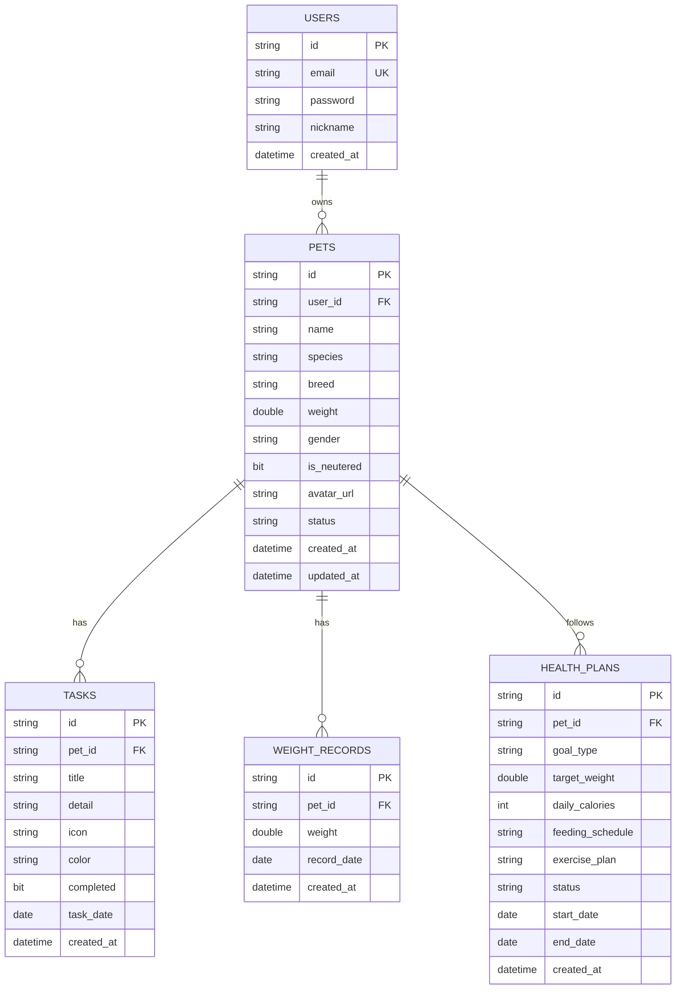

# Pet Health - 数据库设计文档

本项目使用 MySQL 8.4 数据库，采用关系型数据库设计，通过 Spring Data JPA 进行实体管理。

---

## 1. 实体关系图 (ERD)

---

## 2. 数据表详解

### 2.1 用户表 (`users`)
存储系统用户信息及登录凭证。

| 字段名 | 类型 | 约束 | 说明 |
| :--- | :--- | :--- | :--- |
| `id` | varchar(255) | PRIMARY KEY | 用户唯一标识 (UUID) |
| `email` | varchar(255) | UNIQUE, NOT NULL | 登录邮箱 |
| `password` | varchar(255) | NOT NULL | 登录密码 (明文，建议后续加密) |
| `nickname` | varchar(255) | - | 用户昵称 |
| `created_at` | datetime(6) | - | 注册时间 |

### 2.2 宠物表 (`pets`)
存储宠物的基本信息和当前状态。

| 字段名 | 类型 | 约束 | 说明 |
| :--- | :--- | :--- | :--- |
| `id` | varchar(255) | PRIMARY KEY | 宠物唯一标识 |
| `user_id` | varchar(255) | FOREIGN KEY | 所属用户 ID |
| `name` | varchar(255) | NOT NULL | 宠物名字 |
| `species` | varchar(255) | NOT NULL | 物种 (cat/dog) |
| `breed` | varchar(255) | - | 品种 |
| `weight` | double | - | 当前体重 (kg) |
| `gender` | varchar(255) | - | 性别 |
| `is_neutered` | bit(1) | - | 是否绝育 |
| `avatar_url` | varchar(255) | - | 头像地址 (Base64) |
| `status` | varchar(255) | - | 当前心情状态 (happy/playing/sleeping) |
| `created_at` | datetime(6) | - | 创建时间 |
| `updated_at` | datetime(6) | - | 最后更新时间 |

### 2.3 任务表 (`tasks`)
存储每日需要执行的宠物护理任务。

| 字段名 | 类型 | 约束 | 说明 |
| :--- | :--- | :--- | :--- |
| `id` | varchar(255) | PRIMARY KEY | 任务唯一标识 |
| `pet_id` | varchar(255) | FOREIGN KEY | 所属宠物 ID |
| `title` | varchar(255) | NOT NULL | 任务标题 (如：早餐喂食) |
| `detail` | varchar(255) | - | 任务详情 (如：50克干粮) |
| `icon` | varchar(255) | - | 图标标识 (utensils/droplets等) |
| `color` | varchar(255) | - | UI 显示颜色 |
| `completed` | bit(1) | NOT NULL | 是否已完成 |
| `task_date` | date | - | 任务所属日期 |

### 2.4 体重记录表 (`weight_records`)
存储宠物的历史体重数据，用于生成趋势图。

| 字段名 | 类型 | 约束 | 说明 |
| :--- | :--- | :--- | :--- |
| `id` | varchar(255) | PRIMARY KEY | 记录唯一标识 |
| `pet_id` | varchar(255) | FOREIGN KEY | 所属宠物 ID |
| `weight` | double | NOT NULL | 记录时的体重 (kg) |
| `record_date` | date | NOT NULL | 记录日期 |

### 2.5 健康计划表 (`health_plans`)
存储 AI 生成的个性化宠物健康管理计划。

| 字段名 | 类型 | 约束 | 说明 |
| :--- | :--- | :--- | :--- |
| `id` | varchar(255) | PRIMARY KEY | 计划唯一标识 |
| `pet_id` | varchar(255) | FOREIGN KEY | 所属宠物 ID |
| `goal_type` | varchar(255) | NOT NULL | 目标类型 (lose/gain/maintain) |
| `target_weight` | double | - | 目标体重 (kg) |
| `daily_calories` | int | - | 建议每日摄入热量 |
| `feeding_schedule` | varchar(2000) | - | 喂食时间表 (JSON 字符串) |
| `exercise_plan` | varchar(1000) | - | 运动建议 |
| `status` | varchar(255) | NOT NULL | 计划状态 (active/archived) |

---

## 3. 设计要点说明

1. **UUID 标识**: 所有表的主键均采用 UUID 字符串，方便分布式扩展和数据迁移。
2. **JPA 自动同步**: 后端通过 `spring.jpa.hibernate.ddl-auto=update` 确保 Java 实体类与数据库表结构保持一致。
3. **软删除与状态**: 宠物和计划主要通过 `status` 字段管理，而非物理删除，以保留历史轨迹。
